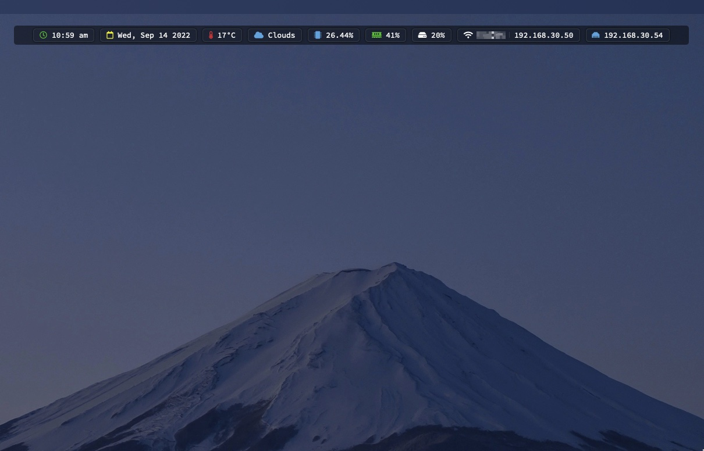

# StatBar
A simple status bar for Mac OS X. Built upon [MiniBar](https://github.com/neutonfoo/MiniBar-Widget)



# Installation
1. Clone the repository and move StatBar.widget into the `~/Library/Application Support/Übersicht/widgets` folder.
2. In `config.json` replace `OPENWEATHERMAP_APIKEY` with your own API key from [OpenWeatherMap](https://openweathermap.org/api).
3. In index.jsx, change the following options:

```javascript
const screenWidth = window.screen.width;

// Change the width of the bar
const barWidth = screenWidth - 40

const options = {
    // How far from the top of the screen the bar should be.
    top: "20px",

    // How far from the left of the screen the bar should be. Currently set to center.
    left: screenWidth / 2 - barWidth / 2 + "px",

    // Refer to https://en.wikipedia.org/wiki/List_of_tz_database_time_zones
    timezone: "Australia/Sydney",

    // The disk/partition you want to monitor.
    disk: "/dev/disk3s5"
};

```